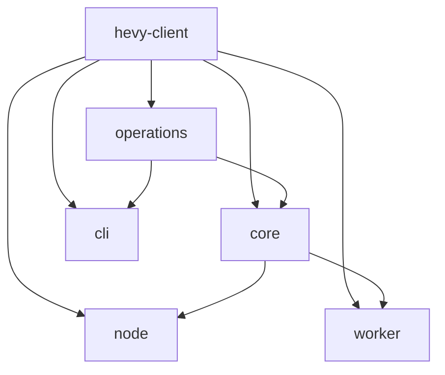

# Architecture

`hevy-mcp` exposes the Hevy API through one shared MCP tool contract on Node.js
and Cloudflare Workers. The root is a private workspace orchestrator with no
runtime `src/` tree.

## Workspace ownership and dependencies

[repository/topology.json](../repository/topology.json) owns workspace
boundaries, allowed imports, and release propagation.

| Workspace              | Package                 | Responsibility                                                                          |
| ---------------------- | ----------------------- | --------------------------------------------------------------------------------------- |
| `packages/hevy-client` | `@hevy-mcp/hevy-client` | Runtime-neutral native-fetch client and generated types/schemas                         |
| `packages/operations`  | `@hevy-mcp/operations`  | Runtime-neutral domain operations and shared mutation schemas                           |
| `packages/core`        | `@hevy-mcp/core`        | Runtime-neutral MCP construction, tools, prompts, resources, execution, and diagnostics |
| `packages/node`        | `hevy-mcp`              | Node stdio/Streamable HTTP adapter, process lifecycle, telemetry, and update checks     |
| `packages/worker`      | `@hevy-mcp/worker`      | Cloudflare Streamable HTTP adapter, bindings, OAuth, and Worker observability           |
| `packages/cli`         | `@chrisdoc/hevy-cli`    | Standalone Node command-line client, not an MCP wrapper                                 |

Arrows below run from dependency to consumer:



The client, Operations, and Core must not import Node built-ins or Cloudflare
bindings. Node and Worker consume shared packages but never import one another;
the CLI consumes the client and Operations without Core. The
[boundary configuration](../repository/topology.json) constrains package
subpaths as well as package dependencies.

Only Node and CLI are published to npm. Shared packages are bundled into their
consumers; Worker is deployed directly. Private workspaces still have versions
for release/deployment identity. For release eligibility and the downstream
Changeset cascade, use the [release policy](../CONTRIBUTING.md#git-and-pull-requests)
and topology rather than maintaining a second matrix here.

## Core construction and registration

[server.ts](../packages/core/src/server.ts) constructs a server-scoped client,
Operations services, exercise-template catalog cache, and MCP runtime. Core's
source responsibilities are:

- `src/tools/`: domain tool definitions, registration, and co-located tests.
- `src/protocol/`: wire schemas, compatibility parsing, output projections, and
  response contracts.
- `src/prompts/` and `src/resources/`: MCP workflows and resource implementations.
- `src/runtime/`: Effect service composition and request execution controls.
- `src/diagnostics/`: safe error mapping, logging, and observation contracts.
- `src/index.ts`: supported Core export surface.

Tools implement `ToolDefinition.execute` as an Effect with schema-inferred
arguments. [register.ts](../packages/core/src/tools/register.ts) registers the
catalog through [define-tool.ts](../packages/core/src/tools/define-tool.ts),
which validates inputs, applies compatibility parsing where declared, executes
through `ToolRuntime.createHandler`, and assembles contract-shaped responses.
Read tools declare output schemas; write tools preserve any declared schemas.
`feedback` uses the unobserved registration path rather than the ordinary
identity-bearing tool observer.

Do not copy the older direct `server.registerTool`/async-handler pattern into
new tools. Reuse the existing runtime, error policy, response contracts, and
safe diagnostics. See [AGENTS.md](../AGENTS.md#mcp-changes) and
[the type-safety guide](./TYPE_SAFETY_GUIDE.md) for implementation rules.

## Execution ownership and Promise facades

Effect controls shared Hevy retry schedules, attempt/operation deadlines, and
interruption. Abort signals bridge to native `fetch`; callers retain ordinary
web-platform cancellation behavior. Ownership is nested:

```text
Node process lifecycle (telemetry, signals, transport)
  └─ MCP server (shared services and catalog cache)
       └─ tool/resource request (deadline and MCP cancellation signal)
            └─ Hevy request (retry, timeout, interruption)
```

Supported Promise facades remain available: `HevyClient`,
`createHevyMcpServer`, `createNodeMcpServer`, `runStdioServer` / `runServer`,
operation `.execute()`, and CLI `execute` / `runCli`. Tool implementations must
not introduce independent Effect runners.

The Node package's [public entry point](../packages/node/src/index.ts) does not
bootstrap a runtime when imported. Embedded `createNodeMcpServer` receives an
explicit API key and leaves transport and telemetry ownership to its caller.
The executable [runtime](../packages/node/src/runtime.ts) owns startup probing,
telemetry, and lifecycle instead.

Worker OAuth and request handling remain Promise-based; validation-cache retry
uses Effect. MCP contracts remain Zod schemas, and Node environment/argument
parsers remain throwing parsers. This is not an Effect-wide adapter rewrite.

## Adapter lifetime and caches

- **Node stdio:** one MCP server for the process lifetime.
- **Node HTTP:** a separate MCP server and catalog cache for each initialized
  client session. The transport owns session limits, idle eviction, and cleanup.
- **Worker:** a fresh MCP server, client, transport, and catalog cache for each
  request; no cross-key catalog sharing or persistent MCP session.

The catalog cache lasts five minutes and holds one catalog. Worker API-key
validation has a separate 15-minute hashed-key cache; OAuth also persists
encrypted grants. Neither should be confused with the request-scoped catalog
cache. See [deployment modes](./deployment-modes.md) for authentication,
transports, and health probes, and [observability](./observability.md) for
adapter-specific telemetry and collector ownership.

## Generated client and curated exports

Kubb generates client artifacts from the checked-in OpenAPI specification.
Never hand-edit `packages/hevy-client/src/generated/`. Do not ignore unexpected
generated errors: correct the specification or generator configuration,
regenerate, and inspect the full diff. Upstream compatibility corrections live
in `scripts/codegen/openapi-spec.js`; fetching upstream is needed only for an
intentional API-contract refresh.

Consumers use topology-approved curated exports, including the client root,
types, and schemas. Generated API functions and `.kubb` internals are private.
See [generated-client procedures](../CONTRIBUTING.md#generated-api-client) for
commands and synchronization checks.

## SDK compatibility

[stdio-observability.ts](../packages/node/src/utils/stdio-observability.ts)
instruments private MCP SDK stdio fields (`_ondata`, `_readBuffer`, `_buffer`)
for privacy-bounded chunk and parser diagnostics. When expected fields are
absent, instrumentation is skipped and the transport is left unchanged. SDK
upgrades therefore require inspecting those assumptions and running the named
stdio lane. [CONTRIBUTING.md](../CONTRIBUTING.md#required-validation) owns the
required checks; [test-lanes.md](./test-lanes.md) explains lane selection.
